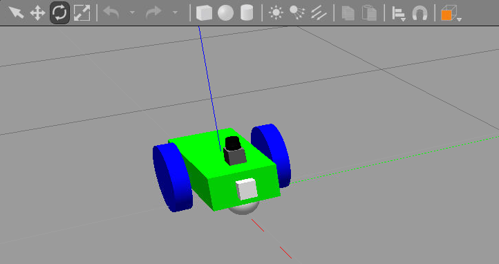

# UDACITY Robot Engeneer ND Project: ChaseIt


Intermediate Step Robot Model



## Project Goal


## Project Description

### Directory Structure


### Validate the Project

To validate you will need to download, build and execute the project ChaseIt.
This project is meant to run in UDACITY Workspace, other environments might be possible.

#### Download the Project

```bash
git clone https://github.com/SAHOWI/ChaseIt.git ChaseIt
```
#### Build the Project

```bash
cd  ChaseIt/catkin_ws
catkin_make
``

#### Run the Project

```bash
cd  ChaseIt/catkin_ws
source devel/setup.bash
roslaunch my_robot world.launch
```


