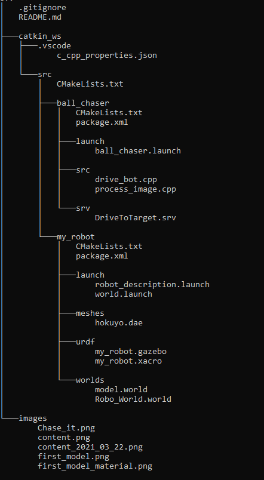
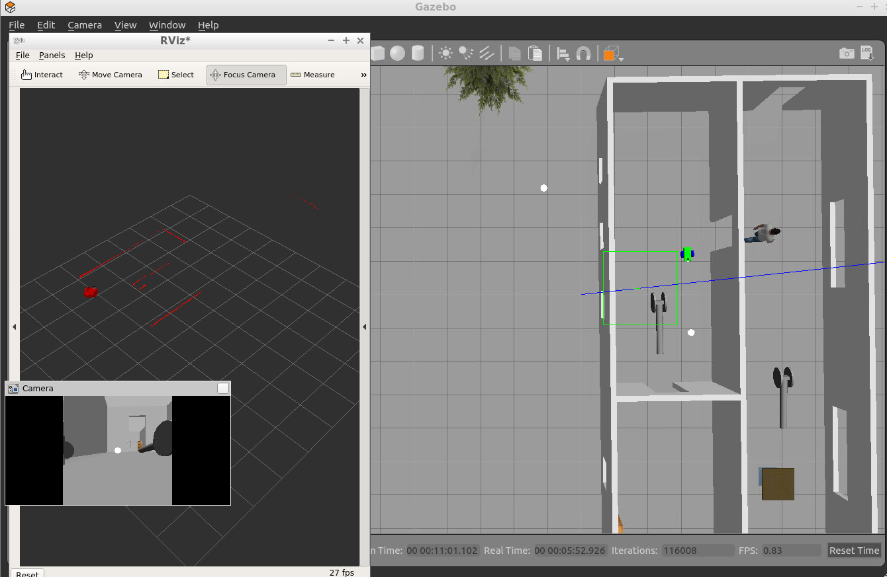

# UDACITY Robot Engeneer ND Project: ChaseIt


Intermediate Step Robot Model


## Project Goal


## Project Description

### Directory Structure




### Validate the Project

To validate you will need to download, build and execute the project ChaseIt.
This project is meant to run in UDACITY Workspace, other environments might be possible.

#### Download the Project

```bash
git clone https://github.com/SAHOWI/ChaseIt.git ChaseIt
```
#### Build the Project

```bash
cd  ChaseIt/catkin_ws
catkin_make
```

#### Run the Project

To run the project you must start the various packages 

##### Launch the robot inside the world

```bash
cd  ChaseIt/catkin_ws
source devel/setup.bash
roslaunch my_robot world.launch
```

##### Run the drive_robot and process_image nodes

```bash
cd  ChaseIt/catkin_ws
source devel/setup.bash
roslaunch ball_chaser ball_chaser.launch
```

##### Visualize the camera output
You can subscribe to the image topic within RViz (this results to a similar Screenshot as below), or you utilize the rqt_image_view node:
```bash
cd  ChaseIt/catkin_ws
source devel/setup.bash
rosrun rqt_image_view rqt_image_view
```

You will see that all is started, but the robot is just turning around where he is, as there is no whit ball in his view.
There is a white ball placed outside of the house (left side) - pick and place (or copy and paste) it somewhere in the same room as the robot.
If the ball is not hidden behind any furniture, people or somethign else it will localize the ball, and move forward to it.





